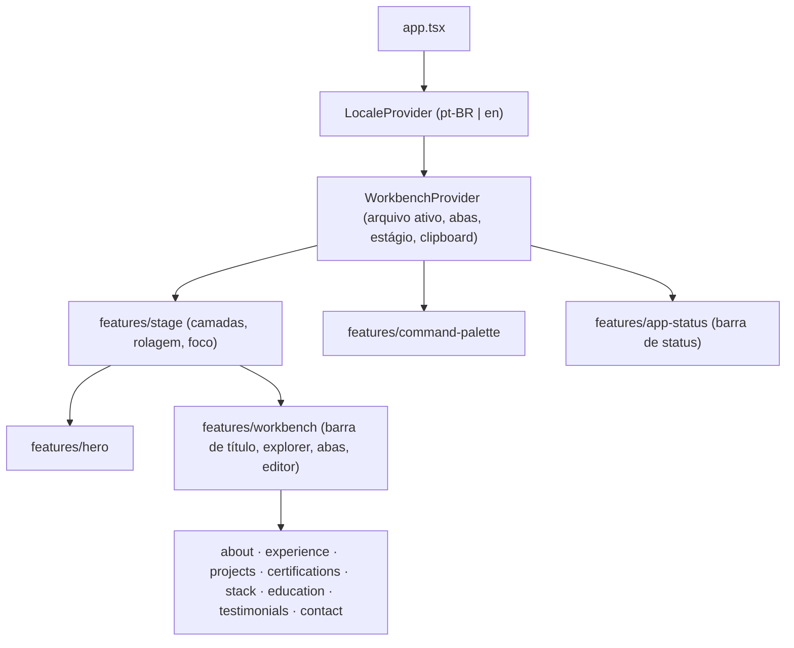

# Arquitetura

Portfólio de Gilberto Alves, implementado a partir do protótipo **"Portfolio A -
Workbench"** do Claude Design. O site imita um editor de código: um hero em tela
cheia que, ao rolar, dá lugar a um workbench com explorer, abas, editor, paleta
de comandos e barra de status. Cada seção do portfólio é um "arquivo".

> Este documento descreve o que existe no código e o roteiro das próximas
> etapas. Itens marcados como _planejado_ ainda não foram implementados.

## Composição da tela



O workbench não importa as features das seções: recebe do `app.tsx` a prop
`files`, um `Record<WorkbenchFileId, ComponentType>`, mantendo a regra de que
uma feature nunca importa outra. O tipo exige as 8 seções.

### Workbench (`features/workbench`)

```
┌ header: ☰ (só < md) · gilberto-alves. · arquivo — portfolio · Baixar currículo ┐
├ nav explorer (260px) ┬ abas (Arquivos abertos) ─────────────────────────────┤
│ PORTFOLIO            │ portfolio › arquivo                                 │
│   arquivos…          ├ main ──────────────────────────────────────────────┤
│ LINKS                │ 1  │ seção do arquivo ativo (até 980px)            │
│   GitHub ↗           │ 2  │ …                                             │
│   LinkedIn ↗         │ …  │ [ ← anterior            próximo → ]           │
│   Baixar currículo ↓ │    │                                               │
└──────────────────────┴────┴───────────────────────────────────────────────┘
```

- Abaixo de `md` (860px) o explorer vira gaveta sobre o editor, aberta pelo ☰
  (`aria-expanded`/`aria-controls`). Abrir qualquer arquivo fecha a gaveta.
- O editor é remontado por arquivo (`key`), então cada arquivo abre no topo e
  com o fade de entrada.
- A numeração de linhas acompanha a altura do conteúdo (`ResizeObserver`, uma
  linha a cada 20px, no mínimo 40) e é `aria-hidden`.
- Fechar a aba ativa ativa a última aba restante; fechar a última reabre
  `sobre.md`.

### Barra de status (`features/app-status`)

Esquerda: arquivo ativo e um `role="status"` com "Pronto" ou "✓ E-mail
copiado" (o feedback do clipboard do contexto, venha a cópia de onde vier).
Direita: "Brasil ·" (só a partir de `md`), a hora de Brasília (`HH:mm:ss`,
atualizada a cada segundo) e o botão `PT-BR | EN`.

### Estágios (`features/stage` + `features/hero`)

```
 hero ──(rolar ↓, "Abrir workbench", arquivo do explorer do hero)──▶ workbench
   ▲                                                                  │
   └──────────(rolar ↑ no topo do arquivo, logo, arquivo na barra de status)
```

- O `Stage` empilha as duas telas (recebidas do `app.tsx` como `heroScreen` e
  `workbenchScreen`). A tela que não é a atual fica `inert` e, quando
  totalmente coberta, `invisible`.
- O motor (`useStageMotion`, no `WorkbenchProvider`) guarda alvo e progresso
  (0 = hero, 1 = workbench). A cada quadro o progresso anda uma fração da
  distância até o alvo — 35% ao seguir a rolagem (só suaviza os degraus da
  roda), 12% nas animações de botão e atalho — e vai, linear, para a variável
  CSS `--stage-progress` da raiz. As utilidades `stage-hero` (some, sobe e
  encolhe à metade) e `stage-workbench` (sobe de baixo) leem essa variável:
  **não há render do React por quadro**; o React só atualiza ao trocar de
  estágio ou de visibilidade.
- **Rolagem livre:** roda do mouse e toque movem o alvo na proporção da
  própria altura da tela (rolar uma altura = transição inteira), como o
  conteúdo de uma página, e a transição **fica onde a rolagem parar**, sem
  encaixe. Parada no meio, a tela atual é a que passou da metade. Nas pontas,
  a rolagem primeiro rola o conteúdo que ainda tem para onde ir (o hero para
  baixo; o arquivo aberto para cima).
- A URL só muda quando a página repousa num estágio (só uma tela visível);
  parada no meio, mantém o último hash.
- Com `prefers-reduced-motion`, qualquer movimento vai direto ao estágio.
- Foco: se a troca deixa o foco na tela que ficou `inert` (ou no `body`), ele
  vai para a tela nova.
- O hero (`features/hero`) tem o nome como `h1`, os papéis digitados (leitores
  de tela recebem só o primeiro; com movimento reduzido ele aparece inteiro), a
  headline, o botão "Abrir workbench" e um explorer que abre cada arquivo.

## Estado compartilhado

| Contexto (`src/context/`) | Responsabilidade | Status |
| --- | --- | --- |
| `locale/` | idioma ativo (`pt` padrão, `en`), persistência em `localStorage` (`gb-portfolio-lang`), `<html lang>`, `toggleLocale` | implementado |
| `workbench/` | arquivo ativo e abas (`openFile`, `closeTab`, `stepFile`), clipboard compartilhado | implementado |
| `workbench/` (estágio) | `stage`, visibilidade das telas, `showStage`, `moveStageBy` (ver Estágios) | implementado |
| `workbench/` (paleta) | `paletteOpen`, `openPalette`, `closePalette`, `togglePalette` | implementado |
| `workbench/` (atalhos) | `shortcutsEnabled`, `toggleShortcuts` (`localStorage` `gb-portfolio-shortcuts`) | implementado |

### URL

O hash segue a tela pelo `id` do arquivo, que não muda com o idioma:
`#/projects` no workbench, nenhum hash no hero (`useHashSync`).

- Um link com `#/contact` abre direto no workbench, com o arquivo aberto e sem
  animação.
- Cada troca de tela vira uma entrada no histórico: voltar e avançar do
  navegador passeiam pelos arquivos e pelo hero.
- Um hash desconhecido é descartado na primeira sincronização (sem criar
  entrada).

### Infraestrutura compartilhada

| Onde | O quê |
| --- | --- |
| `constants/workbench-files.ts` | os 8 arquivos por `id` (ícone, nome e título por idioma) e a ordem deles (`workbenchFileIds`) |
| `constants/links.ts` | e-mail, GitHub, LinkedIn e o CV (`src/assets/gilberto-alves-cv.pdf`) |
| `constants/ui-text.ts` | rótulos usados por 2+ features (Explorer, Seções, Links, Comandos, Baixar currículo, Copiar e-mail, E-mail copiado) |
| `constants/storage-keys.ts`, `media-queries.ts`, `durations.ts` | chaves de `localStorage`, consultas de mídia (`wide` = 860px, reduced motion), duração do feedback de cópia |
| `hooks/use-media-query` | segue uma media query (`useSyncExternalStore`) |
| `hooks/use-local-storage` | preferência em JSON; valor inválido ou storage bloqueado não quebram |
| `hooks/use-clipboard` | copia e marca `copied` por 2,2 s; cópia recusada não é anunciada |
| `utils/locale` | `Locale`, `Localized<T>`, `isLocale`, `htmlLangs` |
| `utils/cyclic-step` | passo circular para arquivo anterior/próximo |
| `utils/open-files` | regras puras de abrir arquivo e fechar aba |

## Design tokens

Os tokens vêm do **giba-ds** (tema Back to Black + ayu) e ficam em
`src/styles/`:

```
global.css ─┬─ tailwindcss
            ├─ fonts.css    Iosevka (woff2, subset latino, ~220 KB no total)
            ├─ tokens.css   paleta crua: --gray-*, --ink-*, --syn-*, --ayu-*
            ├─ theme.css    @theme: tokens semânticos do Tailwind
            └─ base.css     padrões de elementos (foco, links, scrollbar, reduced motion)
```

Princípios do giba-ds aplicados no tema:

- **Fundo preto puro**; contraste vem da opacidade do branco, não do matiz:
  `text-strong` (100%), `text-body` (62%), `text-muted` (47%), `text-faint`
  (23%), `text-ghost` (8%).
- **Cor só como sintaxe esmaecida** (`text-syn-keyword`, `text-syn-tag`…) e um
  único acento dourado (`bg-accent`, `text-accent`).
- **Bordas em vez de sombras**: `border-subtle`, `border-default`,
  `border-strong`; sombras só em sobreposições (`shadow-popup`, `shadow-lift`).
- **Tipografia**: Iosevka para display e código; sans do sistema para a
  interface. Escala de UI 10/11/12/13/18px (`text-xs` … `text-xl`), prosa
  14/15px (`text-prose`, `text-prose-lg`) e títulos fluidos
  (`text-display-xs` … `text-display-hero`), cada um com sua altura de linha e
  tracking.
- **Medidas do editor**: `h-title-bar` (38px), `h-tab-bar` (36px),
  `h-status-bar` (24px), `w-sidebar` (260px), `w-gutter` (64px, numeração de
  linhas).
- **Movimento** curto e ease-out: `animate-reveal` (200ms), `animate-blink`
  (cursor do hero).

As escalas padrão do Tailwind substituídas são zeradas, então classes fora do
design system (`bg-red-500`, `text-base`) não geram CSS.

## Componentes globais

Ficam em `src/components/`, um por pasta, todos com teste. Os do giba-ds foram
reescritos com Tailwind e HTML semântico (o protótipo usava `div` clicável e
estado de hover em JavaScript).

| Componente | Partes | Uso |
| --- | --- | --- |
| `Button` | — | `primary`, `secondary`, `ghost`; `md`, `sm`; `as="a"` para links |
| `Kbd` | — | teclas: `⌘`, `K`, `esc`, `[`, `]` |
| `FileIcon` | — | ícones de tipo de arquivo (`markdown`, `typescript`, `react`, `json`, `yaml`, `shell`, `folder-open`), decorativos |
| `ListItem` | — | linhas do explorer: `icon`, `nested`, `chevron`; selecionada via `aria-current="page"` |
| `Tabs` | `Tab`, `TabTrigger`, `TabClose` | abas de arquivos abertos (`icon` no `TabTrigger`); fechar e selecionar são botões separados |
| `StatusBar` | `StatusBarGroup`, `StatusBarItem`, `StatusBarButton` | rodapé (`contentinfo`) com textos e ações |
| `Code` | `CodeToken` | linhas de código em Iosevka; `CodeToken` colore por `kind` (`comment`, `keyword`, `function`, `property`, `string`, `punctuation`) |
| `Section` | `SectionTitle` | cada arquivo do portfólio; a seção é rotulada pelo título automaticamente |
| `Timeline` | `TimelineItem`, `TimelinePeriod`, `TimelineBody`, `TimelineTitle` | experiência e formação |
| `Overline` | — | rótulo de painel em caixa alta, 10px ("EXPLORER", "LINKS"); polimórfico (`as="h2"`) |

`Button`, `ListItem`, `Code` e `Overline` são polimórficos (`as`), tipados por
`GenericTag` (`src/utils/generic-tag`). O `EmptyState` do giba-ds ficou de
fora: o único uso no protótipo era em depoimentos, que agora tem um depoimento mock.

## Paleta de comandos (`features/command-palette`)

- Abre com `⌘K` (Apple) / `Ctrl K` (demais), pelo botão "⌘K Comandos" da barra
  de título ou pelo `⌘K` da barra de status. O rótulo e o
  `aria-keyshortcuts` seguem o dispositivo (`constants/keyboard.ts`).
- É um `<dialog>` modal nativo: prende o foco, deixa o resto da página inerte,
  fecha com Esc, clique fora ou ao executar um comando. O painel é montado a
  cada abertura, então a busca começa vazia.
- Campo como combobox ARIA (`aria-activedescendant`); `↓`/`↑` movem a seleção
  (param nas pontas), Enter executa, passar o mouse seleciona.
- Busca sem acento e sem caixa em rótulo, dica e grupo
  (`utils/command-search`).
- Comandos (`utils/palette-commands`): as 8 seções; ações (trocar idioma — o
  rótulo vem no idioma de destino —, copiar e-mail, baixar CV, ir ao início);
  links (GitHub, LinkedIn em nova aba).

## Seções

Cada arquivo do workbench é uma feature com `content/` tipado por idioma,
tipos em `utils/<tema>/<tema>.types.ts` e o visual de "código" do protótipo.
Todas usam `Section` + `SectionTitle`, então cada uma é uma região nomeada pelo
título; as linhas de código decorativas (`export const experience = [`) são
`aria-hidden`.

| Feature | Arquivo | Forma |
| --- | --- | --- |
| `about` | `sobre.md` | frase de abertura como título, parágrafos e fatos em `dl` |
| `experience` | `experiencia.ts` | `Timeline` de empregos, com selo "Atual" no atual |
| `projects` | `projetos.tsx` | grade `grid-cols-cards` de `ProjectCard` numerados |
| `certifications` | `certificacoes.json` | comentário `// certificacoes.json` (ausente no protótipo) e lista `"name"`/`"issuer"`; nomes iguais nos dois idiomas |
| `stack` | `stack.yaml` | grade `grid-cols-stack` de grupos (`h3`) e itens |
| `education` | `formacao.md` | `Timeline` de cursos |
| `testimonials` | `depoimentos.md` | citação (`figure`/`blockquote`); **conteúdo mock** em `content/testimonials.ts`, a substituir pelas recomendações reais |
| `contact` | `contato.sh` | `ContactRow`s: `$ mail` copia o e-mail, `$ open` abre LinkedIn/GitHub em nova aba, `$ curl -O` baixa o CV |

## Idiomas

Todo texto de produto existe em pt-BR (padrão) e inglês. O conteúdo de cada
feature fica em `content/` como `Record<Locale, T>`; uma tradução faltando
quebra o `tsc`.

## Teclado e acessibilidade

| Atalho | Ação | Onde |
| --- | --- | --- |
| `⌘K` / `Ctrl K` | abre e fecha a paleta de comandos | sempre |
| `Enter` | abre o workbench (exceto com foco em botão ou link) | hero |
| `1`–`8` | abre o arquivo correspondente | hero e workbench |
| `[` / `]` | arquivo anterior / próximo | workbench |
| `Esc` | volta ao hero (ou fecha a paleta) | workbench |
| `L` | alterna o idioma | sempre |

- Atalhos de uma tecla ignoram teclas digitadas em campos ou com modificador,
  e não escutam com a paleta aberta (`utils/single-key-shortcuts`).
- Podem ser desativados e reativados pela paleta ("Desativar atalhos de uma
  tecla"), com a escolha salva em `localStorage` (WCAG 2.1.4). Desativados,
  somem as teclas da paleta, do pager e o `↵` da dica do hero.
- Botões com atalho expõem `aria-keyshortcuts`.
- A paleta segue o padrão combobox (`aria-activedescendant`) e prende o foco;
  ao trocar de estágio, o foco vai para o estágio visível.

### Auditoria (Lighthouse 12, desktop, build de produção)

| Tela | Performance | Acessibilidade | Boas práticas | SEO |
| --- | --- | --- | --- | --- |
| hero (`/`) | 100 | 96 | 100 | 100 |
| workbench (`/#/projects`) | 100 | 96 | 100 | 100 |

Ajustes de acessibilidade sobre o protótipo:

- **Contraste:** `text-muted` subiu de branco 44% para 47% (`--ink-47`,
  `#787878` no preto), 4,76:1, acima dos 4,5:1 do WCAG 1.4.3. `text-faint`,
  `text-ghost` e o comentário do hero continuam abaixo, mas são decorativos
  (numeração de linhas, números dos projetos). A exceção é o idioma inativo do
  botão da barra de status (`EN` em `text-faint`, 1,87:1), texto real que segue
  pendente.
- **Tamanho de alvo:** as linhas do explorer têm 24px de altura (o VS Code usa
  22px) e o "×" das abas tem uma área de clique de 24px em volta do glifo
  (WCAG 2.5.8).

## Roteiro

| # | Etapa | Status |
| --- | --- | --- |
| 1 | Fundação: Tailwind + tokens, fontes, `cn`, alias `@/`, Vitest | concluída |
| 2 | Componentes globais: `Button`, `Kbd`, `FileIcon`, `ListItem`, `Tabs`, `StatusBar`, `Code`, `Section`, `Timeline` | concluída |
| 3 | Infraestrutura: contexto de idioma, tipos de conteúdo, `constants/`, hooks globais | concluída |
| 4 | Shell do workbench: navegação, barra de título, explorer, abas, trilha, numeração de linhas, paginação, barra de status | concluída |
| 5 | Seções (depoimentos com um mock por enquanto) e composição no `app.tsx` | concluída |
| 6 | Hero e transição por rolagem (o logo e o arquivo da barra de status voltam ao hero) | concluída |
| 7 | Paleta de comandos | concluída |
| 8 | Atalhos globais, hash da URL e acabamento (a11y, SEO, Lighthouse) | concluída |
| 9 | Deploy | a definir |

## Referência do protótipo

O pacote exportado do Claude Design fica em `developer-portfolio-design/`
(ignorado pelo git). O arquivo principal é
`project/Portfolio A - Workbench.dc.html`; o conteúdo bilíngue está em
`project/portfolio-content.js` e o design system em `project/_ds/`.
