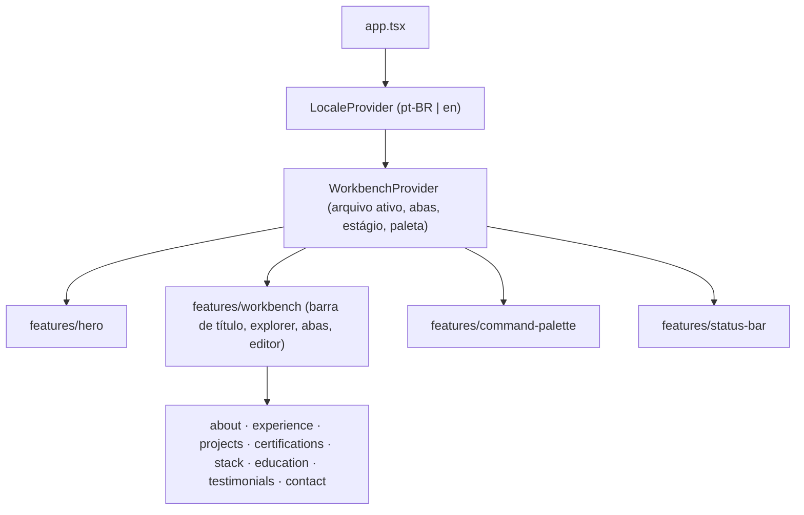

# Arquitetura

Portfólio de Gilberto Alves, implementado a partir do protótipo **"Portfolio A -
Workbench"** do Claude Design. O site imita um editor de código: um hero em tela
cheia que, ao rolar, dá lugar a um workbench com explorer, abas, editor, paleta
de comandos e barra de status. Cada seção do portfólio é um "arquivo".

> Este documento descreve o que existe no código e o roteiro das próximas
> etapas. Itens marcados como _planejado_ ainda não foram implementados.

## Composição da tela



_Planejado._ O workbench não importa as features das seções: o `app.tsx` passa
o mapa `{ about: About, … }` para ele, mantendo a regra de que uma feature nunca
importa outra.

### Estágios

```
 hero ──(rolar, Enter, "Abrir workbench")──▶ workbench
   ▲                                             │
   └────────(Esc, "Início", logo, rolar ↑)───────┘
```

A transição acompanha a rolagem (roda do mouse e toque): o progresso vai de 0 a
1 com suavização e encaixa no estágio mais próximo (limiar de 35%). Com
`prefers-reduced-motion`, a troca é imediata.

## Estado compartilhado

| Contexto (`src/context/`) | Responsabilidade | Status |
| --- | --- | --- |
| `locale/` | idioma ativo, persistência em `localStorage`, `<html lang>` | planejado |
| `workbench/` | arquivo ativo, abas abertas, estágio, paleta aberta, feedback de cópia | planejado |

O arquivo ativo é sincronizado com o hash da URL (`#/projetos`), permitindo
link direto e o botão voltar do navegador.

## Design tokens

Os tokens vêm do **giba-ds** (tema Back to Black + ayu) e ficam em
`src/styles/`:

```
global.css ─┬─ tailwindcss
            ├─ fonts.css    Iosevka (woff2, subset latino, ~220 KB no total)
            ├─ tokens.css   paleta crua: --gray-*, --ink-*, --syn-*, --ayu-*
            ├─ theme.css    @theme: tokens semânticos do Tailwind
            └─ base.css     padrões de elementos (foco, links, scrollbar, reduced motion)
```

Princípios do giba-ds aplicados no tema:

- **Fundo preto puro**; contraste vem da opacidade do branco, não do matiz:
  `text-strong` (100%), `text-body` (62%), `text-muted` (44%), `text-faint`
  (23%), `text-ghost` (8%).
- **Cor só como sintaxe esmaecida** (`text-syn-keyword`, `text-syn-tag`…) e um
  único acento dourado (`bg-accent`, `text-accent`).
- **Bordas em vez de sombras**: `border-subtle`, `border-default`,
  `border-strong`; sombras só em sobreposições (`shadow-popup`, `shadow-lift`).
- **Tipografia**: Iosevka para display e código; sans do sistema para a
  interface. Escala de UI 10/11/12/13/18px (`text-xs` … `text-xl`), prosa
  14/15px (`text-prose`, `text-prose-lg`) e títulos fluidos
  (`text-display-xs` … `text-display-hero`), cada um com sua altura de linha e
  tracking.
- **Medidas do editor**: `h-title-bar` (38px), `h-tab-bar` (36px),
  `h-status-bar` (24px), `w-sidebar` (260px), `w-gutter` (64px, numeração de
  linhas).
- **Movimento** curto e ease-out: `animate-reveal` (200ms), `animate-blink`
  (cursor do hero).

As escalas padrão do Tailwind substituídas são zeradas, então classes fora do
design system (`bg-red-500`, `text-base`) não geram CSS.

## Idiomas

Todo texto de produto existe em pt-BR (padrão) e inglês. O conteúdo de cada
feature fica em `content/` como `Record<Locale, T>`; uma tradução faltando
quebra o `tsc`.

## Teclado e acessibilidade

| Atalho | Ação | Onde |
| --- | --- | --- |
| `⌘K` / `Ctrl K` | abre e fecha a paleta de comandos | sempre |
| `Enter` | abre o workbench | hero |
| `1`–`8` | abre o arquivo correspondente | hero e workbench |
| `[` / `]` | arquivo anterior / próximo | workbench |
| `Esc` | volta ao hero (ou fecha a paleta) | workbench |
| `L` | alterna o idioma | sempre |

Os atalhos de uma tecla só podem ser desativados pela paleta ("Desativar
atalhos"), com a escolha salva em `localStorage`, atendendo ao critério WCAG
2.1.4. A paleta segue o padrão combobox (`aria-activedescendant`) e prende o
foco; ao trocar de estágio, o foco vai para o estágio visível.

## Roteiro

| # | Etapa | Status |
| --- | --- | --- |
| 1 | Fundação: Tailwind + tokens, fontes, `cn`, alias `@/`, Vitest | concluída |
| 2 | Componentes globais: `Button`, `Kbd`, `ListItem`, `Tabs`, `StatusBar`, `EmptyState`, `FileIcon`, cabeçalho de seção, linha do tempo | pendente |
| 3 | Infraestrutura: contexto de idioma, tipos de conteúdo, `constants/`, hooks globais | pendente |
| 4 | Shell do workbench: navegação, barra de título, explorer, abas, trilha, numeração de linhas, paginação, barra de status | pendente |
| 5 | Hero e transição por rolagem | pendente |
| 6 | Seções (depoimentos com um mock por enquanto) | pendente |
| 7 | Paleta de comandos | pendente |
| 8 | Atalhos globais, hash da URL e acabamento (a11y, SEO, Lighthouse) | pendente |
| 9 | Deploy | a definir |

## Referência do protótipo

O pacote exportado do Claude Design fica em `developer-portfolio-design/`
(ignorado pelo git). O arquivo principal é
`project/Portfolio A - Workbench.dc.html`; o conteúdo bilíngue está em
`project/portfolio-content.js` e o design system em `project/_ds/`.
